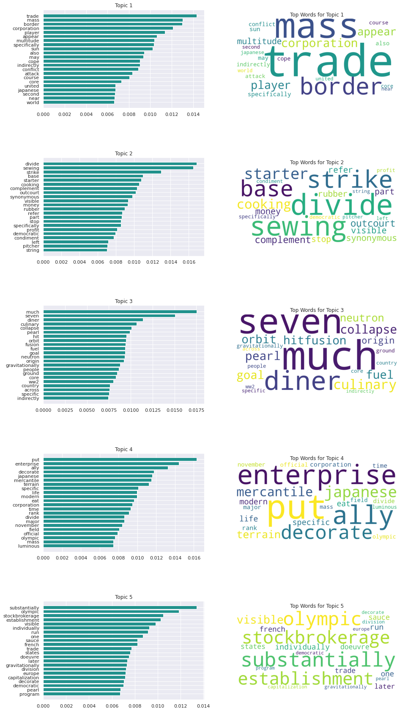
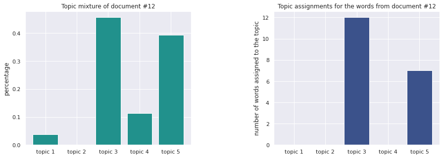
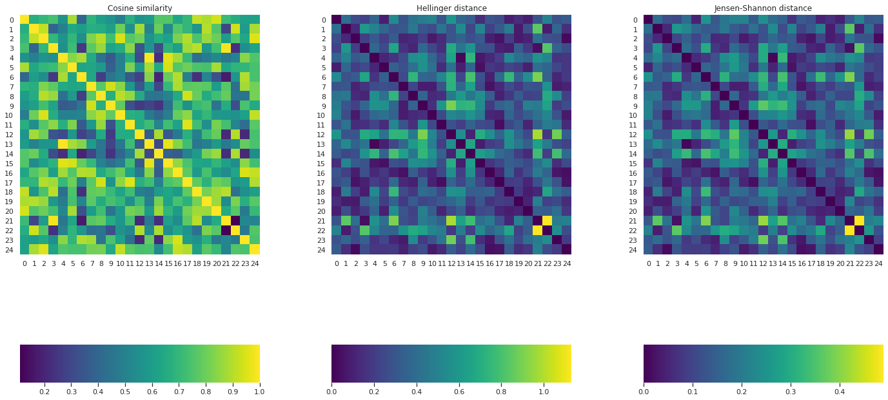
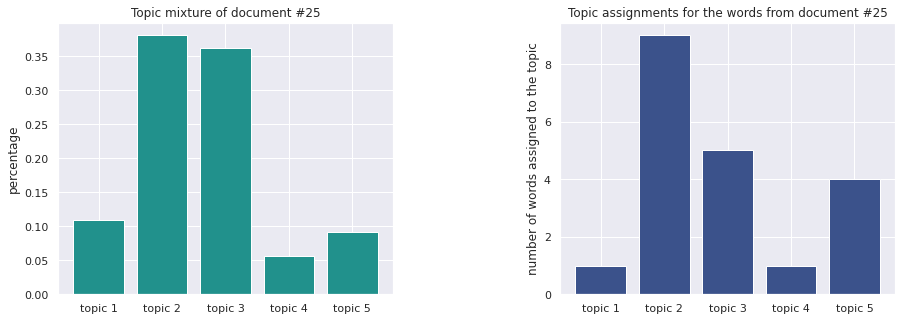

# Probabilistic Programming

This repo contains two projects on Probabilistic Programming. The notebooks in html format can also be found in this repo.

1. **Latent Dirichlet Allocation (LDA) in PyMC**

    Given a set of documents from different topics, the main goal is:
      - to infer the documents distribution over the topics
      - to infer the topic distribution over the vocabulary

            Found 5 topics and 25 documents.

            -----------------------------------------------------------------------------------------------------------------
            This dataset is formed by extracting text from different Wikipedia articles. Each document is 2-3 sentences long.

            TOPIC 1: ASTRONOMY
            1: https://en.wikipedia.org/wiki/Solar_System
            2: https://en.wikipedia.org/wiki/Super-Earth
            3: https://en.wikipedia.org/wiki/Cosmology
            4: https://en.wikipedia.org/wiki/Supernova_remnant
            5: https://en.wikipedia.org/wiki/Star

            TOPIC 2: BUSINESS
            1: https://en.wikipedia.org/wiki/Business
            2: https://en.wikipedia.org/wiki/Stock_market
            3: https://en.wikipedia.org/wiki/Corporation
            4: https://en.wikipedia.org/wiki/Wall_Street
            5: https://en.wikipedia.org/wiki/NASDAQ

            TOPIC 3: COOKING
            1: https://en.wikipedia.org/wiki/Food_presentation
            2: https://en.wikipedia.org/wiki/Entr%C3%A9e
            3: https://en.wikipedia.org/wiki/Condiment
            4: https://en.wikipedia.org/wiki/Vegetarianism
            5: https://en.wikipedia.org/wiki/Culinary_arts

            TOPIC 4: HISTORY
            1: https://en.wikipedia.org/wiki/World_War_II
            2: https://en.wikipedia.org/wiki/Soviet%E2%80%93Japanese_border_conflicts
            3: https://en.wikipedia.org/wiki/German_Revolution_of_1918%E2%80%931919
            4: https://en.wikipedia.org/wiki/Spanish_Civil_War
            5: https://en.wikipedia.org/wiki/Second_Sino-Japanese_War

            TOPIC 5: SPORTS
            1: https://en.wikipedia.org/wiki/Tennis
            2: https://en.wikipedia.org/wiki/Golf
            3: https://en.wikipedia.org/wiki/Baseball
            4: https://en.wikipedia.org/wiki/Handball
            5: https://en.wikipedia.org/wiki/Volleyball

            -----------------------------------------------------------------------------------------------------------------

            A random data sample:
            The Spanish Civil War exposed political divisions across Europe. The right and the Catholics supported the Nationalists to stop the spread
            of Bolshevism. On the left, including labour unions, students and intellectuals, the war represented a necessary battle to stop the spread
            of fascism.

          
            
            Cosmology is a branch of astronomy concerned with the studies of the origin and evolution of the universe, from the Big Bang to today and on
            into the future. It is the scientific study of the origin, evolution, and eventual fate of the universe.

            Topic assignments for the words in this document:
            -------------------------------------------------
            Topic 1: 
            Topic 2: 
            Topic 3: cosmology, astronomy, study, origin, evolution, universe, big, today, scientific, origin, evolution, eventual
            Topic 4: 
            Topic 5: branch, concern, bang, future, study, fate, universe
    
          
  
    Additional tasks:
      - topic-based similarity between documents
      - assign topic to a new document

          
    
            A supernova is a powerful and luminous stellar explosion. This transient astronomical event occurs  during the last evolutionary stages of a
            massive star or when a white dwarf is triggered into runaway nuclear fusion.

            Topic assignments for the words in this document:
            -------------------------------------------------
            Topic 1: last
            Topic 2: powerful, stellar, explosion, transient, evolutionary, star, white, nuclear, fusion
            Topic 3: supernova, astronomical, occur, stage, massive
            Topic 4: luminous
            Topic 5: event, dwarf, trigger, runaway
    
          

2. **Bayesian Learning for Neural Networks in Pyro**

    The task: comparing bayesian networks and classic neural networks.
    This comparison is done by considering the following tasks:
      - a linearly separable binary classification problem
      - a non-linearly separable binary classification problem
      - a multinomial classification problem
    Extra experiment: in the case of bayesian networks, the weights and bias are inferred; inference over the network architecture (i.e. hidden layer size) was also attempted.
    
    [images with the problems]
    
    Result summary:
      Problem type | Bayesian Network results | Classic Network results | Notes
      --- | --- | --- | ---
      Binary classification (linearly separable) | 100% test acc. | 100% test acc. | Sanity check, same results, simple and quick inference/training
      Binary classification (non-linearly separable) | 95% test acc. | 96% test acc. | More complex problem, same results, neccesity of more complex networks and more inference/training time
      Multinomial classification | 80% test acc. | 90% test acc. | The classic network clearly outperformed the bayesian network
